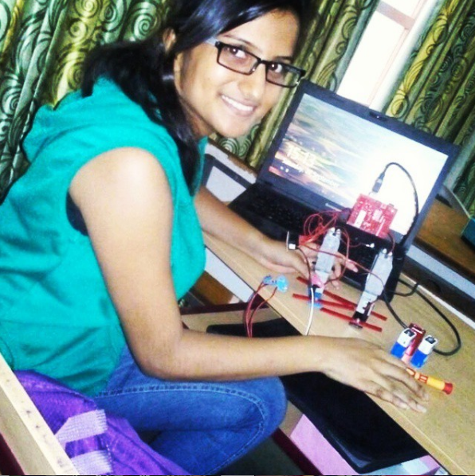

# BipedRobot
A humanoid robot is a robot with its body shape built to resemble the human body. The design may be for functional purposes, such as interacting with human tools and environments, for experimental purposes, such as the study of bipedal locomotion, or for other purposes. 
 Biped robots represent a very interesting research subject, with several particularities and scope topics, such as: mechanical design, gait simulation, patterns generation, kinematics, dynamics, equilibrium, stability, kinds of control, adaptability, biomechanics, cybernetics, and rehabilitation technologies.
<h1>Meet Ruby A Mini Biped Robot That Dances!</h1>

